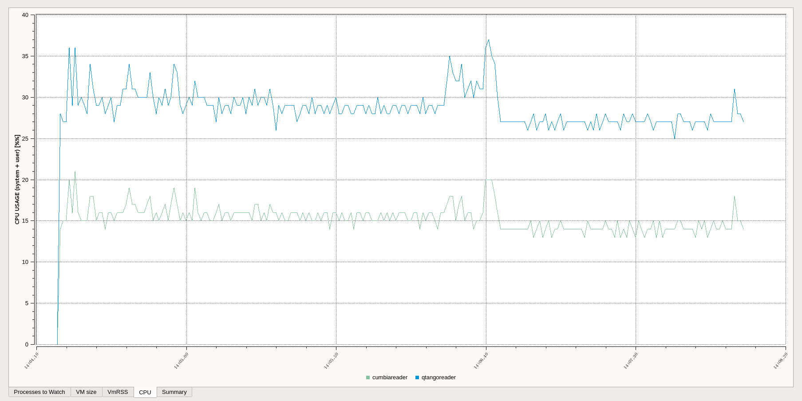

# cumbia library documentation   [<a href="news.html">news</a>]

### Write your own activities
Concentrate on the task you want to run in the background and use *cumbia* base library to write custom *activities* that will be executed on a separate
thread. You will receive the progress updates and the results when they are ready. Nevermind thread synchronization issues.

### Connect with the Tango and Epics (and more...) control system software
Write graphical user interface components and applications communicating with the Tango and Epics control systems. More control system engines can be
added in the future and plugged into existing cumbia installations and applications.

### Combine results into formulas and functions
Mixing the  Qt *javascript* integration and the *cumbia formula plugin*, read results from Tango and Epics
can be introduced into functions. The results can be displayed into any *cumbia-qtcontrols* widget.
Refer to the <a href="html/cuformula/html/index.html">formula plugin</a> section for details.

### Realize Qt applications without writing any code
<a href="html/la-cumparsita/html/index.html">la-cumparsita</a> is an application that interprets *Qt designer UI files* on the fly and performs as a
full C++ Qt application in style and behavior. For the most demanding users, *la-cumparsita* allows
*javascript* integration to display function results as described earlier in this page.

### Test application interface, performance and usability without connecting to real control system engines
The <a href="html/cumbia-random/html/index.html">cumbia-random</a> module offers an interface to periodically generate random data of a given size and within a given range.
Additionally, JavaScript files can be used as data sources. Read more about *cumbia-random*
<a href="html/cumbia-random/html/index.html">here</a>.

### Use the included apps (with bash Tango source auto completion!) to access immediately multiple control systems
A Qt graphical client and a command line application are ready to communicate with the supported control systems and
the *cumbia-random* module. An external <a href="https://github.com/ELETTRA-SincrotroneTrieste/qumbia-tango-findsrc-plugin">plugin</a>
makes Tango source <b>bash auto completion</b> possible!

### Getting started
- Download and install *cumbia*, following to the instructions in the <a href="https://github.com/ELETTRA-SincrotroneTrieste/cumbia-libs">cumbia-libs</a> *README.md*
file.
- <a href="html/qumbiaprojectwizard/html/tutorial_qumbiatango.html">Write your first <em>Qt application</em> with cumbia and Tango</a>
- Find answers to common questions in the <a href="html/qumbia-tango-controls/html/tutorial_faq.html">FAQ section</a> (Tango)

### Examples
Several examples come along with the library. Just look for the *examples* directories under each subproject.

- Under the *cumbia-tango* module, you'll find examples to write a multi threaded Tango server using cumbia *activities* and read properties from the database.
- *cumbia-qtcontrols* includes examples of usage of some widgets as well as writing a simple activity to understand the basic concepts and thread
management.
- *qumbia-tango-controls* provides examples of a *multireader*, a widget refreshed *manually* and an application that helps understand the
  concept of *cumbia-qtcontrols* *context* (<a href="html/cumbia-qtcontrols/html/classCuContext.html">CuContext</a>).
- *qumbia-epics-controls* is shipped with examples showing how to use widgets with EPICS
- *qumbia-plugins* will teach you how to integrate formulas into applications

More examples you will find within cumbia sources!

### Keywords and technologies
- C++-11
- <a href="https://www.qt.io/">Qt</a>
- <a href="https://doc.qt.io/qt-5.11/qtwidgets-index.html">Qt widgets</a>
- <a href="https://doc.qt.io/qt-5.11/qtqml-index.html">Qt QML</a>
- <a href="https://www1.qt.io/qt-quick/">Qt Quick</a>
- <a href="http://www.tango-controls.org/">Tango</a>
- <a href="https://epics.anl.gov/">EPICS</a>
- <a href="https://www.android.com/">Android</a>
- <a href="https://en.wikipedia.org/wiki/Linux">Linux</a>

### Everywhere
cumbia is written in C++ and uses the Qt libraries to develop graphical user interfaces. This means *cumbia applications* work on *desktop computers* as well as
on *Android* devices. In principle, cumbia is available *wherever C++ and Qt are supported*. *Android* and *Linux* platforms have been successfully tested and
porting an application from one platform to another is just a matter of a few clicks with the *Qt creator* IDE.

<small><strong>Figure 1.</strong> A cumbia application running on an Android device reads from the <a href="http://www.tango-controls.org/">Tango</a> control system through a 
*websocket* connection to the *canoned* server provided by the <a href="https://gitlab.com/PWMA">PWMA</a> project (GPL3 LICENSE).</small>

### Plugins
*cumbia* libraries provide a set of fundamental capabilities that can be summarized in the concepts above. A set of plugins extends those functions
and new ones can be added. The core framework remains small and easy to maintain, while the capabilities extend distributed.
The set of widgets offered by the base *cumbia-qtcontrols* module can be extended by plugins as well.

### Screenshots
<a href="screenshots.html">Here</a> you can see some screenshots of applications written with *cumbia*.

### Installation

To download and install *cumbia*, refer to the instructions in the <a href="https://github.com/ELETTRA-SincrotroneTrieste/cumbia-libs">cumbia-libs</a> *README.md*
file.

Instructions to prepare an *ubuntu-desktop* for *cumbia*, can be found in the *README.UBUNTU.md* file under 
<a href="https://github.com/ELETTRA-SincrotroneTrieste/cumbia-libs">cumbia-libs</a>.

The library sources include copies of the *README.md* and *README.UBUNTU.md* files in the top level directory.

### Tutorials

 |Tutorials                                     | Module               |
 |-------------------------------------------------------------------|--------------------------|
 |  <a href="html/cumbia/html/tutorial_cuactivity.html">Writing a *cumbia* activity</a> | <a href="html/cumbia/html/index.html">cumbia</a> |
 |  <a href="html/cumbia-tango/html/tutorial_activity.html">Writing an activity</a> | <a href="html/cumbia-tango/html/index.html">cumbia-tango</a> |
 |  <a href="html/cumbia-tango/html/cudata_for_tango.html">CuData for Tango</a> | <a href="html/cumbia-tango/html/index.html">cumbia-tango</a> |
 |  <a href="html/qumbia-tango-controls/html/tutorial_cumbiatango_widget.html">Writing a Qt widget that integrates with cumbia</a> | <a href="html/qumbia-tango-controls/html/index.html">qumbia-tango-controls</a>  |
 |  <a href="html/cuuimake/html/cuuimake.html">Using <em>cumbia ui make</em></a> to process Qt designer UI files | <a href="html/cuuimake/html/index.html">qumbia-apps/cuuimake</a>  |
 |  <a href="html/qumbiaprojectwizard/html/tutorial_qumbiatango.html">Writing a <em>Qt application</em> with cumbia and Tango</a>. |<a href="html/qumbiaprojectwizard/html/index.html">qumbia-apps/qumbiaprojectwizard</a>  |
 |  <a href="html/qumbiaprojectwizard/html/tutorial_from_qtango.html">Porting a <em>QTango application</em> to <em>cumbia-tango</em></a>. |<a href="html/qumbiaprojectwizard/html/index.html">qumbia-apps/qumbiaprojectwizard</a>  |
 |  <a href="html/qumbianewcontrolwizard/html/tutorial_qumbianewcontrolwizard.html"><em>cumbia new control</em></a>: quickly add a custom Qt widget to a cumbia project | <a href="html/qumbianewcontrolwizard/html/index.html">qumbia-apps/qumbianewcontrolwizard</a>  |
 |  <a href="html/cumbia-qtcontrols/html/understanding_cumbia_qtcontrols_constructors.html">Understanding <em>cumbia-qtcontrols constructors, sources and targets</em></a> |<a href="html/cumbia-qtcontrols/html/index.html">cumbia-qtcontrols</a>. |
 |  <a href="html/qumbia-tango-controls/html/tutorial_faq.html">Frequently Asked Questions (Tango)</a> | <a href="html/qumbia-tango-controls/html/index.html">qumbia-tango-controls</a>  |
 |  <a href="html/cumbia-qtcontrols/html/tutorial_extending_widgets.html">Extending the widget library</a> |<a href="html/cumbia-qtcontrols/html/index.html">cumbia-qtcontrols</a>. |

### Modules

 |*cumbia* modules  |                         |
 |-------------------------------------------------------------------|
 | <a href="html/cumbia/html/index.html">cumbia base</a>.  | <a href="html/qumbia-epics-controls/html/index.html">qumbia-epics-controls</a>.  |
 | <a href="html/cumbia-tango/html/index.html">cumbia-tango</a>.  | <a href="html/cumbia-random/html/index.html">cumbia-random</a>.  |
 | <a href="html/cumbia-qtcontrols/html/index.html">cumbia-qtcontrols</a>.   | <a href="html/cumbia-websocket/html/index.html">cumbia-websocket</a>.  |
 | <a href="html/qumbia-tango-controls/html/index.html">cumbia-tango-controls</a>. | <a href="html/cumbia-qtcontrols/html/qumbia_plugins.html">qumbia-plugins module</a>.  |
 | <a href="html/cumbia-epics/html/index.html">qumbia-epics</a>.   |  |

### Plugins shipped with the base installation
 
 |*cumbia* plugins  | Description |
 |-------------------------------------------------------------------|--------------------|
 | <a href="html/cuformula/html/index.html">formula plugin</a>. | Compose sources into formulas |
 | <a href="html/cumbia-dbus/html/index.html">dbus plugin</a>. | DBus plugin for inter app communication |
 | <a href="html/cumbia-multiread/html/index.html">multi reader plugin</a>. | Read multiple sources |
 | <a href="html/widgets-std-context-menu-actions/html/index.html">context menu actions plugin</a>. | Contextual menu actions plugin for widgets|
 | Qt designer plugin | Qt designer cumbia widget integration |

### Additional plugins

Additional plugins can be downloaded from the <a href="https://github.com/ELETTRA-SincrotroneTrieste/">ELETTRA-Sincrotrone Trieste</a> github page.

|Plugin interfaces to extend *cumbia*  | Description |
|--------------------------------------|-------------------------------------------------------|
| <a href="https://github.com/ELETTRA-SincrotroneTrieste/cumbia-qtcontrols-introspection-plugin">cumbia-qtcontrols introspection plugin</a>. | Look inside cumbia objects |
| <a href="https://github.com/ELETTRA-SincrotroneTrieste/cumbia-tango-introspection-plugin">Tango specific introspection plugin</a>.  | Look inside cumbia-tango objects |
| <a href="https://github.com/ELETTRA-SincrotroneTrieste/qumbia-tango-findsrc-plugin">Plugin and app to search Tango database names</a>. | Find Tango source names (and provide auto completion for apps!) |
| <a href="https://github.com/ELETTRA-SincrotroneTrieste/cumbia-copy-source-context-menu-actions">Add a *copy source* action to the context menu</a>. | Adds a *copy source* action to the widgets contextual menu |
| <a href="https://github.com/ELETTRA-SincrotroneTrieste/textview-xwidgetplugin">Text view extra widget</a>. | Provides a text view widget |

### Apps

*cumbia* provides some applications as part of the software distribution.
If you followed the *scripts/cubuild.sh* install method, they should be ready to use.

Otherwise, they have to be installed from the *qumbia-apps* sub-directory of the *cumbia-libs* distribution.
To do this, *cd* into that folder and execute:
 

> qmake

> make

> sudo make install

 
Along with the application executables and documentation, two bash scripts will be installed:
 
- /usr/local/cumbia-libs/bin/cumbia  (or whatever/install/prefix/bin/cumbia)
- source /usr/local/cumbia-libs/share/bash-completion.d/cumbia (output of `pkg-config --variable=completionsdir bash-completion` can also be used, edit qumbia-apps/cumbia/cumbia.pro and look for BASH_COMPLETION_DIR)

They define shortcuts for the common operations provided by the *cumbia applications* as follows:
 
 
|Applications   | description                                 | app
|------------------------------|--------------------------------------------|:---------------:|
| *cumbia read*                | read a quantity from the supported engines |<a href="html/qumbia-reader/html/index.html">cumbia reader</a>  |
| *cumbia monitor*             | monitor a quantity over time from the supported engines |<a href="html/qumbia-reader/html/index.html">cumbia reader</a>  |
| *cumbia new project*          | create a new cumbia project               |<a href="html/qumbiaprojectwizard/html/index.html">qumbia-apps/qumbiaprojectwizard</a>  |
| *cumbia import*               | migrate a QTango project into cumbia      |<a href="html/qumbiaprojectwizard/html/index.html">qumbia-apps/qumbiaprojectwizard</a>  |
| *cumbia new control*          | write a *cumbia control* reader or writer | <a href="html/qumbianewcontrolwizard/html/index.html">qumbia-apps/qumbianewcontrolwizard</a>  |
| *cumbia ui make*              | run *cuuimake* to generate *qt+cumbia* ui_*.h files | <a href="html/cuuimake/html/index.html">qumbia-apps/cuuimake</a>  |
| *cumbia client*               | run a generic cumbia client | <a href="html/cumbia_client/html/index.html">qumbia-apps/qumbia-client</a>  |
| *cumbia upgrade*              | upgrade to a newer version of cumbia|  - |
| *la-cumparsita*               | on the fly applications from a *Qt designer UI file* | <a href="html/la-cumparsita/html/index.html">qumbia-apps/la-cumparsita</a>  |

*bash auto completion* will help you find out these shortcuts: try

> cumbia [+TAB]
 
or

> cumbia new [+TAB]

After the installation, it may be necessary to type

> source /usr/local/cumbia-libs/share/bash-completion.d/cumbia

from the current shell or log out and log in again.

#### Want to *TangoTest* ?

If the *TangoTest* device is running, you can immediately try the generic *cumbia client*:

> cumbia client test/device/1/double_scalar test/device/1/long_scalar

### Performance

*cumbia* can be seen both as an extension and an evolution of the well known and long standing  *qtango* framework. Additionally, it offers a relevant 
improvement in performance.

<small><strong>Figure 2.</strong> The graph shows a relevant gap in *CPU* usage by two equivalent applications (they read the same *attributes/commands* from the *Tango*
control system and print them on the console), one relying on *qtango* (blue), the other on *cumbia* (green).</small>

### Are you ready?
 
Start reading the <a href="html/cumbia/html/index.html">cumbia base library documentation</a> or <a href="https://elettra-sincrotronetrieste.github.io/cumbia-libs/html/qumbiaprojectwizard/html/index.html">writing a new cumbia application</a>.

