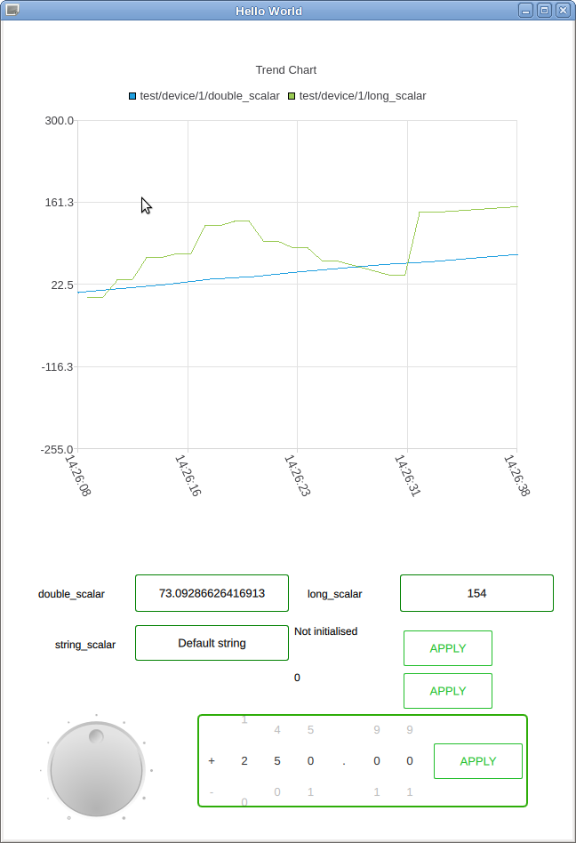
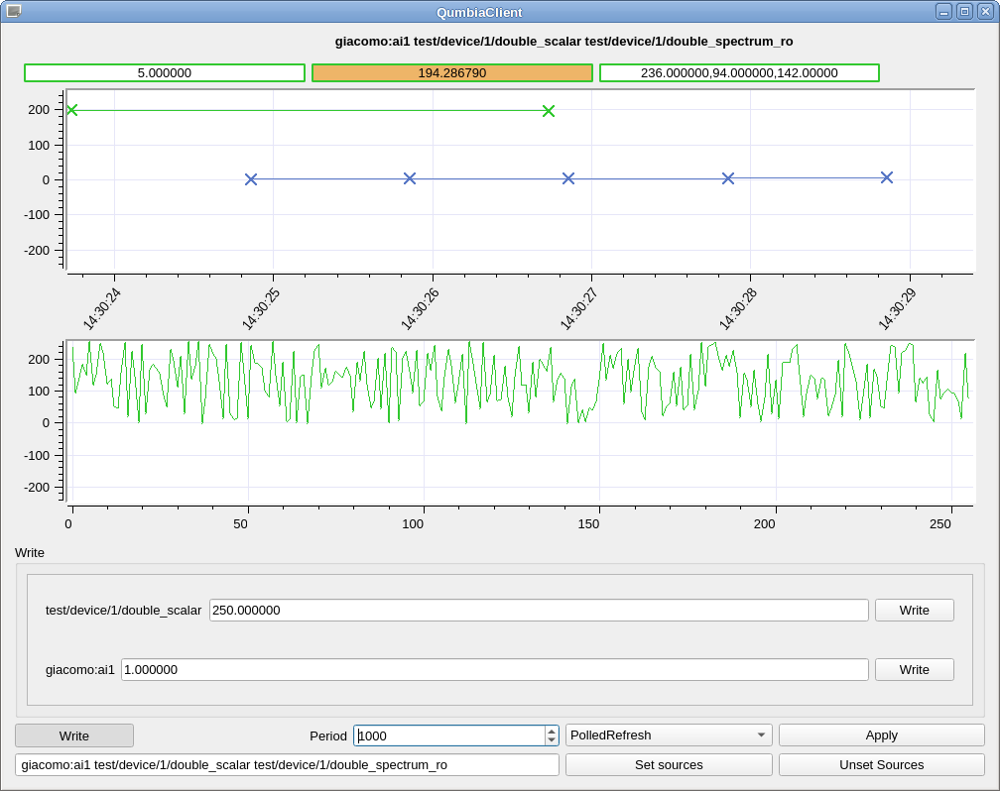

# Screenshots of applications written with the cumbia library

### 1. An application reads Tango test from a mobile device through a websocket, using *canoned* from the PWMA project

<strong>Figure 1.</strong> Three *Tango spectrum attributes* are read through the *websocket* interface provided by the *canoned* server developed
within the <a href="https://gitlab.com/PWMA/">PWMA project</a>.

<strong>Figure 2.</strong> Three *Tango scalar attributes* are read through the very same *websocket* interface

<strong>Figure 3.</strong> *Tango scalar attributes* are displayed by some <em>cumbia QML graphical elements</em> on a mobile device

See also <a href="https://gitlab.com/PWMA/">the PWMA project</a>

### 2. A desktop application using some Qt QML components reads Tango test 

<strong>Figure 4.</strong> A *QML* application with some *cumbia QML* components reads from the *Tango* control system using the 
*qumbia-tango-controls* module.

### 3. A desktop application using classical Qt widgets components reads Tango and Epics

<strong>Figure 5.</strong> A *Qt widgets* application (*cumbia client*) reads from the *Tango* and *Epics* control systems at the same time using the 
*qumbia-tango-controls* and *qumbia-epics-controls*  modules.
